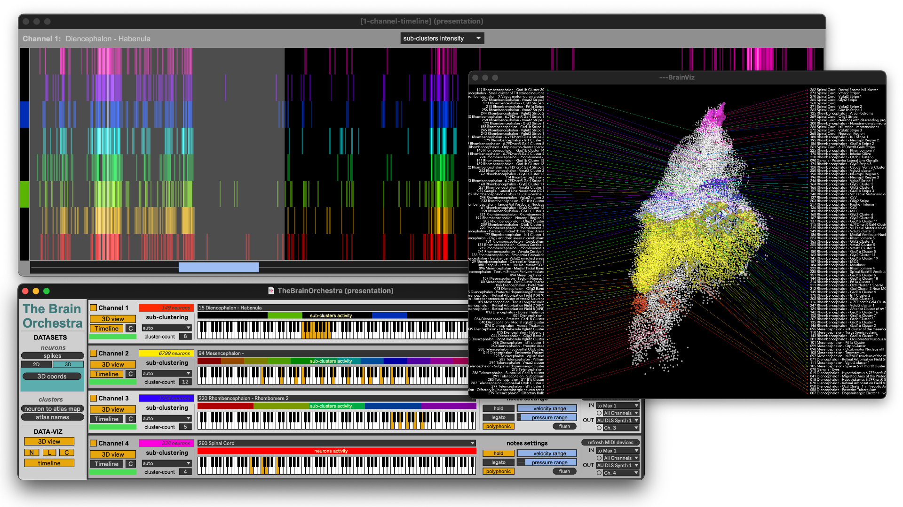

# The Brain Orchestra
<!--  -->

A software for the sonification of neural activity.

## How to install
At the moment, the Brain Orchestra is provided as a Max package. You'll need to:

- get and install the latest release from Max at [https://cycling74.com](https://cycling74.com) ;
- get the latest release from Brain Orchestra package at the [release page](https://github.com/TheBrainOrchestra/TheBrainOrchestra/releases) 
  - (or if you are more confident : clone it or fork it from [this page](https://github.com/TheBrainOrchestra/TheBrainOrchestra));
- put this package in your Max document folder (`home/Documents/Max xx/Packages`);
- open `TheBrainOrchestra.maxpat

## Media
Samples of neural activity sonification are available on this [youtube playlist](https://www.youtube.com/playlist?list=PLLnRE_p6FfmhWEtfWqwcD_iQG91_XiQ6L
) 

## Credits
The *Brain Orchestra* project was developed by Vincent Goudard and Sébastien Wolf (Institut de Biologie de l'ENS).

## References

- Vincent Goudard, Sébastien Wolf. The Brain Orchestra, un outil de sonification de l’activité neuronale. Journées d'Informatique Musicale, GRAME; Inria, Jun 2025, Lyon, France. ⟨hal-05102386v1⟩ [link](https://hal.science/hal-05102386v1/)
